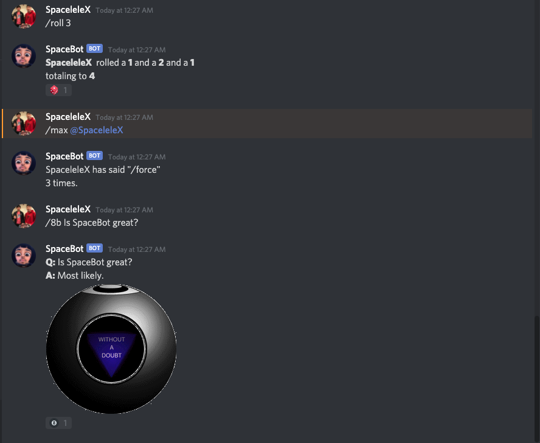
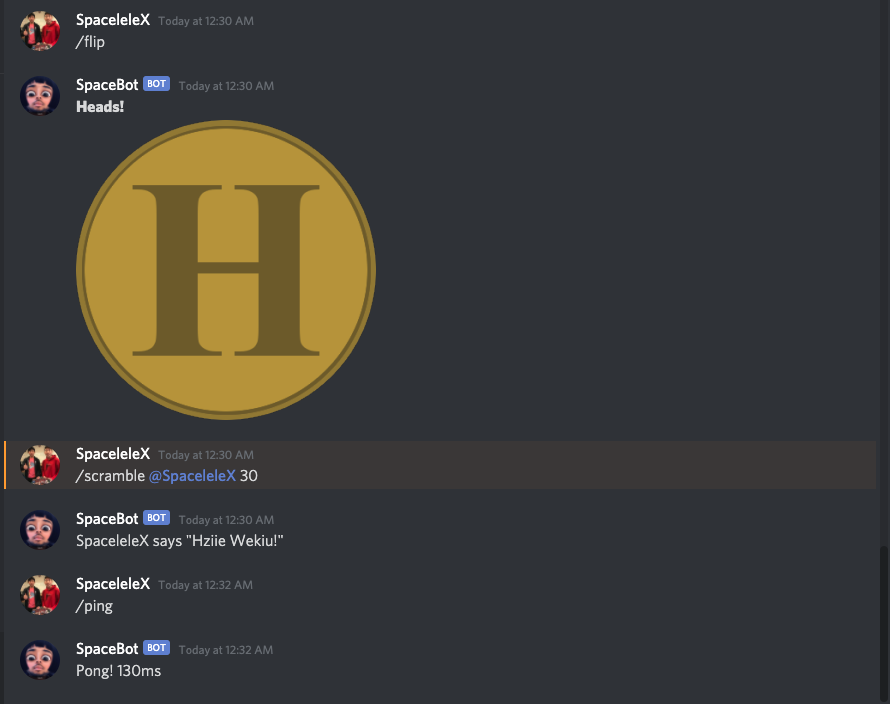

# SpaceBot 
**A Discord bot for fun using the [discord.py API](https://discordpy.readthedocs.io/en/latest/index.html#)**

## Demo (more coming soon)

  
<i>roll, max, and 8b commands</i>
 

  
<i>flip, scramble, and ping commands</i>
 

## Commands
**/ping** - Ping SpaceBot's latency  
**/max** - Display @user's most commonly used phrase  
**/8b** - Ask the magic 8ball a question  
**/say** - Tell SpaceBot something to say  
**/flip** - Flip a coin  
**/roll** - Roll up to 163 die  
**/scoreboard** - Display the die-rolling leaderboard  
**/scramble** - Scramble @user's messages for up to 60 seconds  
 
*And more...*

## Tech
- [discord.py API](https://discordpy.readthedocs.io/en/latest/index.html#)
- [MongoDB](https://www.mongodb.com/)
  - [BSON Custom Encoder](https://api.mongodb.com/python/current/examples/custom_type.html)
- [Google Text-to-Speech](https://pypi.org/project/gTTS/)
- Automated data collection and other background tasks

## Running the bot
- SpaceBot is not available for public use
  - Feel free, however, to use the source code in your own discord.py bots

### Resources
  - Credits go to [@Lucas](https://www.youtube.com/watch?v=nW8c7vT6Hl4) and [@Tech With Tim](https://www.youtube.com/watch?v=xdg39s4HSJQ&) for the Discord Bot tutorials.
  - Credits go to [@Tech With Tim](https://www.youtube.com/watch?v=rE_bJl2GAY8&) for the MongoDB/PyMongo tutorial.
